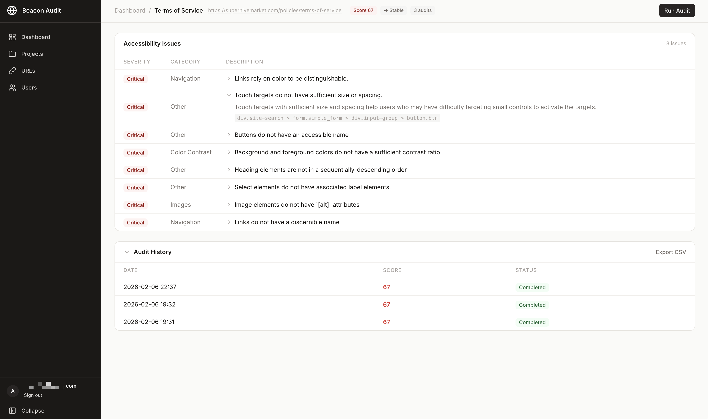

# Beacon Audit

An accessibility monitoring dashboard that tracks website accessibility scores over time using the Google PageSpeed Insights API. Built with PHP 8.4 and SQLite.



## Features

- **Automated Audits** — Schedule daily, weekly, biweekly, or monthly accessibility scans via the PageSpeed Insights API
- **Dashboard** — Overview of all projects with average scores, trends (improving/stable/degrading), and score history graphs
- **Project Organisation** — Group URLs into projects for logical monitoring boundaries
- **URL Management** — Add URLs individually or bulk import via paste list or CSV upload
- **Historical Tracking** — View score history, audit-to-audit comparisons, and trend analysis per URL
- **Issue Tracking** — Detailed accessibility issues logged per audit with descriptions and selectors
- **PDF Reports** — Downloadable per-project PDF reports with executive summary, score distribution, and full issue breakdown by category
- **CSV Export** — Export audit data per URL or as a full summary across all monitored URLs
- **User Management** — Role-based access (admin/viewer) with session authentication and CSRF protection
- **Cron Scheduling** — CLI runner that automatically audits URLs when they're due based on their frequency

## Tech Stack

| Layer | Technology |
|-------|-----------|
| Language | PHP 8.4 |
| Database | SQLite |
| Templating | Twig 3.x |
| HTTP | Symfony HttpFoundation + Routing |
| Styling | Tailwind CSS 4 |
| Interactivity | Alpine.js |
| Charts | Chart.js |
| PDF | DOMPDF |
| API | Google PageSpeed Insights v5 |
| Testing | PHPUnit 11.x |
| Static Analysis | PHPStan Level 9 + strict-rules |
| Code Style | PHP-CS-Fixer (PSR-12) |

## Requirements

- PHP 8.4+ with extensions: `pdo_sqlite`, `mbstring`, `xml`, `curl`, `zip`
- Composer
- Node.js 18+ (for building CSS)

## Installation

```bash
git clone https://github.com/your-username/beaconaudit.git
cd beaconaudit

composer install
npm ci
npm run build
```

Create the environment file:

```bash
cp .env.example .env
```

Edit `.env` with your settings:

```env
APP_ENV=local
APP_DEBUG=true
DB_PATH=storage/database.sqlite
PAGESPEED_API_KEY=your-api-key-here
```

Get a PageSpeed Insights API key from the [Google Cloud Console](https://console.cloud.google.com/apis/credentials).

### Environment Variables

| Variable | Description | Default |
|----------|-------------|---------|
| `APP_ENV` | Environment (`local`, `production`) | `production` |
| `APP_DEBUG` | Enable debug mode (`true`/`false`) | `false` |
| `DB_PATH` | Path to SQLite database file | `storage/database.sqlite` |
| `PAGESPEED_API_KEY` | Google PageSpeed Insights API key | (required) |

> **Note:** The `.env` file is excluded from Git. On a fresh clone (e.g. on a server), you must create it manually — see the [Deployment Guide](DEPLOYMENT.md#8-configure-environment).

Create the database and an admin user:

```bash
touch storage/database.sqlite
php cli/create-user.php --email=admin@example.com --password=your-password --role=admin
```

Database migrations run automatically on the first request.

## Local Development

With [Laravel Herd](https://herd.laravel.com/) (or any PHP dev server):

```bash
# Herd will automatically serve from the public/ directory

# Watch CSS for changes
npm run dev
```

Or use the built-in PHP server:

```bash
php -S localhost:8000 -t public
```

## Running Audits

### Manual

Log in as an admin and click "Run Audit Now" on any URL's detail page in the dashboard.

### Scheduled (Cron)

The scheduled audit runner checks all enabled URLs and runs audits for any that are due based on their configured frequency:

| Frequency | Interval |
|-----------|----------|
| Daily | Every 24 hours |
| Weekly | Every 7 days |
| Biweekly | Every 14 days |
| Monthly | Every 30 days |

Run it manually:

```bash
php cron/run-scheduled-audits.php
```

For automated monitoring, add to crontab (runs every 15 minutes, the runner decides which URLs are due):

```cron
*/15 * * * * cd /path/to/beaconaudit && /usr/bin/php cron/run-scheduled-audits.php >> storage/logs/cron.log 2>&1
```

URLs that have never been audited are considered immediately due, so newly added or imported URLs will be picked up on the next cron run. The audit engine includes automatic retry with exponential backoff (up to 3 retries) for failed API calls, and generates comparisons between consecutive audits to track score changes.

## Bulk Import

Admin users can import multiple URLs at once from the **URLs > Bulk Import** page.

### Paste Mode

Enter one URL per line in the textarea. Each URL is used as both the URL and the display name.

### CSV Upload

Upload a CSV file with a header row. The `url` column is required; `name` and `frequency` are optional:

```csv
url,name,frequency
https://example.com,Example Site,weekly
https://test.com,Test Site,daily
https://other.com,,
```

- If `name` is empty or missing, it defaults to the URL value
- If `frequency` is empty or missing, it uses the frequency selected on the form
- Duplicate URLs (already in the database or within the same batch) are skipped
- Invalid URLs are reported with line numbers and error messages
- Newly imported URLs are considered immediately due and will be picked up by the next scheduled cron run (within 15 minutes)

## CLI Tools

### Create User

```bash
php cli/create-user.php --email=user@example.com --password=secret --role=admin
```

Roles: `admin` (full access) or `viewer` (dashboard read-only). This also runs any pending database migrations.

### Run Scheduled Audits

```bash
php cron/run-scheduled-audits.php
```

Checks all enabled URLs and runs audits for any that are due. Outputs a summary of completed audits with scores and statuses.

## Quality & Testing

```bash
# Run all checks (CS, PHPStan, tests)
composer quality

# Individual commands
composer test           # PHPUnit (298 tests)
composer phpstan        # PHPStan level 9
composer cs-check       # Code style dry-run
composer cs-fix         # Auto-fix code style
```

## Architecture

The application uses a modular, layered architecture:

```
src/
  Modules/
    Url/           URL & project management
    Audit/         PageSpeed API client, audit engine, comparisons
    Dashboard/     Statistics aggregation
    Reporting/     CSV export, PDF reports
    Auth/          Authentication & user management
    Notification/  Notification system (scaffolded)
  Shared/          Exceptions, base classes
  Http/            Controllers, router
  Views/           Twig templates
  Database/        Migrations, connection
```

Each module follows Domain-Driven Design layers:

- **Domain** — Models, Value Objects, Repository Interfaces, Events
- **Application** — Services, Use Cases
- **Infrastructure** — SQLite Repositories, API Clients

## Deployment

See [DEPLOYMENT.md](DEPLOYMENT.md) for a step-by-step guide to deploying on a DigitalOcean LEMP droplet, including SSL setup, cron scheduling, SQLite backups, and log rotation.

## License

This project is licensed under the [MIT License](LICENSE).
